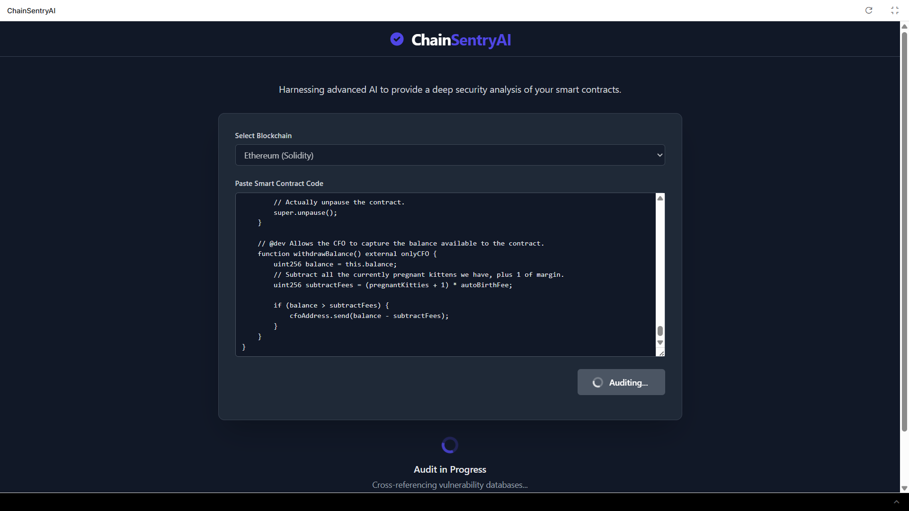
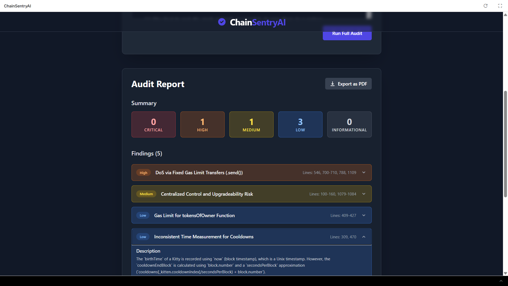

# ChainSentryAI - AI-Powered Smart Contract Auditor

**ChainSentryAI** is a modern, web-based security auditing tool that leverages the power of Google's Gemini API to perform deep, static analysis of smart contracts. It provides developers with a fast, intuitive, and powerful way to identify potential vulnerabilities, understand their impact, and receive actionable recommendations for fixes.


## ✨ Key Features

-   **Multi-Blockchain Support:** Audit smart contracts for both **Ethereum (Solidity)** and **Solana (Rust)**.
-   **Advanced AI Analysis:** Utilizes Google's `gemini-2.5-flash` model with a structured JSON output schema for reliable and detailed vulnerability detection.
-   **Comprehensive Reports:** Generates easy-to-read audit reports with a clear summary of findings.
-   **Detailed Findings:** Each vulnerability includes:
    -   Severity Level (Critical, High, Medium, Low, Informational)
    -   In-depth Description and Potential Impact
    -   Clear Recommendations for Mitigation
    -   AI-generated Code Snippets for Suggested Fixes
-   **PDF Export:** Download a professional, shareable PDF of the full audit report with a single click.
-   **Responsive UI:** A clean, modern, and fully responsive interface built with React and Tailwind CSS.

## 🚀 How It Works

ChainSentryAI streamlines the auditing process by combining a sophisticated frontend with a powerful AI backend.

1.  **Input:** The user pastes their Solidity or Rust smart contract code into the editor and selects the corresponding blockchain.
2.  **Prompt Engineering:** The application constructs a highly-specific prompt, instructing the Gemini model to act as an expert security auditor. This prompt includes the user's code.
3.  **Structured API Call:** A request is sent to the Gemini API, specifying a strict JSON schema for the response. This ensures the data is consistent, reliable, and easy to parse.
4.  **Report Generation:** The AI's JSON response, containing an array of vulnerabilities, is parsed and used to dynamically render a comprehensive and interactive report in the UI.
5.  **Export:** The final report, rendered in the DOM, can be converted into a high-resolution PDF using `html2canvas` and `jsPDF`.

### 🖼️ Screenshots / Demo

- **Audit in Progress (Loading State)**  
  

- **Audit Report Showcase**  
  

## 📂 Codebase Structure

The project follows a standard React component-based architecture to ensure modularity and maintainability.

```
/
├── public/
│   └── vite.svg        # Favicon (Note: this is just an example, not in the provided files)
├── src/
│   ├── components/     # Reusable React components
│   │   ├── AuditForm.tsx
│   │   ├── AuditReportDisplay.tsx
│   │   ├── CodeBlock.tsx
│   │   ├── FindingCard.tsx
│   │   ├── Header.tsx
│   │   └── Loader.tsx
│   ├── services/       # AI service integration
│   │   └── geminiService.ts
│   ├── App.tsx         # Main application component and state logic
│   ├── index.tsx       # Application entry point
│   └── types.ts        # TypeScript type definitions
├── index.html          # Main HTML file with CDN imports
└── metadata.json     # Application metadata
```

## 🛠️ Setup and Running the Project

This project is built to run directly in a browser-based development environment that supports modern web standards and environment variables.

### Prerequisites

-   A modern web browser (Chrome, Firefox, Safari, Edge).
-   A **Google Gemini API Key**.

### Running the Application

1.  **Set Up Environment Variable:**
    -   You must have a `process.env.API_KEY` environment variable configured in your development environment. This variable should contain your valid Google Gemini API Key.
    -   The application is hardcoded to read the key from this variable for security. **Do not paste your key directly into the code.**

2.  **Open `index.html`:**
    -   Load the `index.html` file in your development server or browser environment. The application will mount and be ready to use.
    -   The project uses CDN links via an `importmap` for all dependencies (React, jsPDF, @google/genai, etc.), so there is no need for `npm install` or a build step.

### How to Use

1.  Select the blockchain (Ethereum or Solana) from the dropdown menu.
2.  Paste your smart contract code into the text area.
3.  Click the "Run Full Audit" button.
4.  Wait for the AI to complete its analysis (a loader will indicate progress).
5.  Review the detailed audit report that appears.
6.  Click "Export as PDF" to save a local copy of the report.

## 👨‍💻 Built By

-   **Amay Tripathi** - [GitHub Profile](https://github.com/AmayTrip29)
